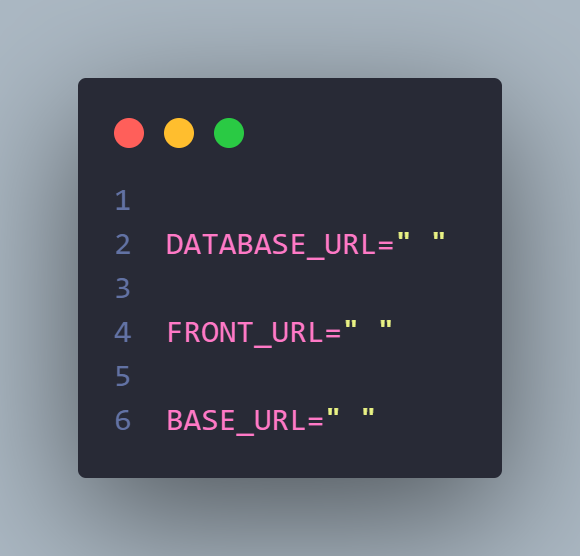

<h1 align="center">API Encurtador de URL</h1>

Essa API tem objetivo de encurtar a URL que desejar e armazenar no banco de dados todas as URL que já foram encurtadas.

## Funcionalidades

- Criar URL
- Listar URLs
- Filtrar URL 
  - por slug
- Atualizar Clicks

## Rotas 

**baseURL** : http://localhost:3333

#### Criar Urls

```bash
  POST /new
```
 As informações devem ser passadas dentro do corpo(body) da requisição.

| Parâmetros   | Tipo       | Descrição                           |
| :---------- | :--------- | :---------------------------------- |
| `longUrl` | `string` | **Obrigatório**. |
| `clicks` | `number` | **Obrigatório**.|

#### Listar URLs

```bash
  GET /urls
```
#### Filtrar URL

```bash
  get /${slug}
```

| Parâmetro   | Tipo       | Descrição                                   |
| :---------- | :--------- | :------------------------------------------ |
| `slug`      | `string` |  **Obrigatório**. O slug reserva que deseja buscar. |

**Observação**: O slug deve ser passado na requisição como route params.


#### Atualizar clicks
```bash
  put /${slug}
```

| Parâmetro   | Tipo       | Descrição                                   |
| :---------- | :--------- | :------------------------------------------ |
| `clicks` | `number` | **Obrigatório**.|
| `slug`      | `string` |  **Obrigatório**. O slug reserva que deseja buscar. |

**Observação**: O slug deve ser passado na requisição como route params.


## Rodando localmente

Antes de começar, você precisa ter o Git e Node  instalados e também ter criado um cluster no MongoDB Atlas.


### Clone o projeto

```bash
  git clone https://github.com/wagnerSfarias/backend-link
```
### Entre no diretório do projeto

```bash
  cd backend-link
```

### Instale as dependências

```bash
  npm install
```

### Configurando o ambiente


É necessario criar um arquivo com o nome, " .env " na raiz do seu projeto.

Exemplo :

 ```shell
 src/
 .env
 .gitignore
 package.json
 ```


  Dentro do arquivo .env, é necessário criar três variáveis de ambiente.
  <br>

  1-Primeira será utilizada para armazenar a URL do MongoDB fornecido pelo MongoDB atlas.
  <br>

  2 - Segunda para armazenar a URL do seu front-end que será utilizada para configurar o cors.
  <br>

  3 - A última para armazenar a url da sua API . 

 Exemplo:




### Inicie o servidor

```bash
  npm run dev
```


## Tecnologias utilizadas 👨🏻‍💻

- Node
- TypeScript
- Express
- Cors
- Primas
- MongoDB Atlas
- Status-codes
- dotenv